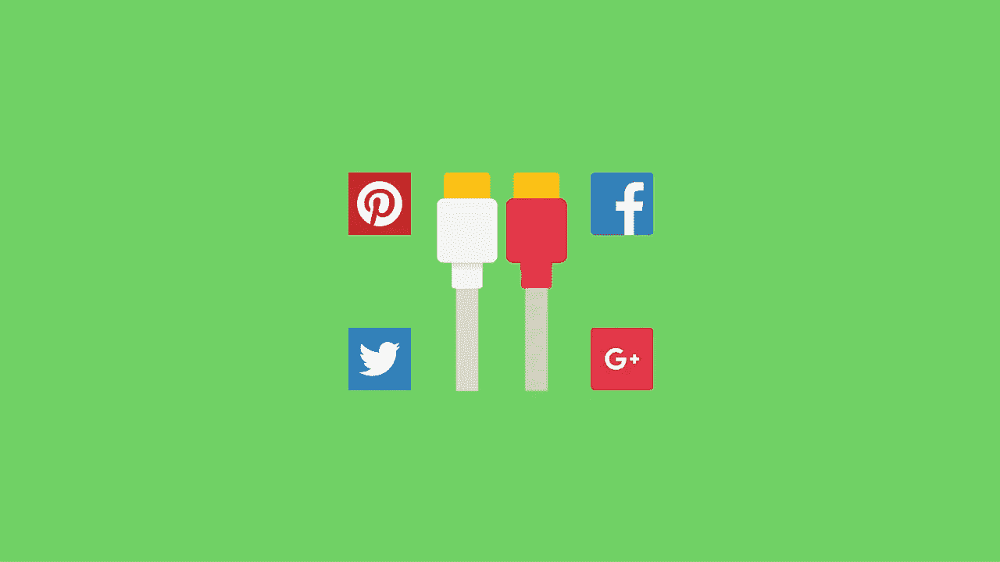
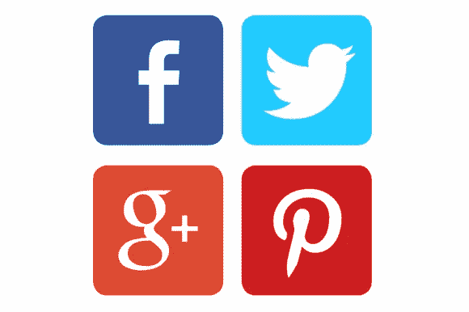

# WordPress 社交网络插件插件

> 原文：<https://medium.com/visualmodo/wordpress-social-networks-widgets-plugins-fb1ce378ea86?source=collection_archive---------0----------------------->

你正在为你的网站寻找最好的 WordPress 社交网络插件吗？WordPress 有如此多的社交媒体插件，以至于初学者很难选择最好的插件。在这篇文章中，我们将向你展示一些最好的 WordPress 社交媒体插件，你可以马上安装。

联系你的读者的最好方式之一是通过社交网站。但是你必须确保你的读者可以很容易地跟踪你的社交资料。如果你不这样做，你就失去了一些社会追随者和一些读者。

当访问者第一次访问你的博客时，他/她对你的博客没有任何概念，但是他/她可能喜欢你的博客文章。为此，你不能指望他/她订阅你的电子邮件列表。你所能期待的就是与社交网站建立联系。因为只需点击一下就可以关注/喜欢你。然而，社交网站也能帮助你联系到你的固定读者，并为他们提供你博客的定期更新。

WordPress 有一些很棒的小工具，可以在你的博客侧边栏上显示你的社交媒体按钮。显示这些按钮会鼓励你的读者在不同的社交网站上关注你。

# WordPress 社交网络插件侧边栏插件

以下是你的 WordPress 博客的最佳社交媒体插件列表。选择一个最适合你的博客。

# 高级社交小工具

如果你想在同一个框中显示社交[媒体](https://visualmodo.com/blog/)图标和电子邮件订阅，那么这个插件就是 foAdvancedAdvaced Social Widget 是一个响应式 WordPress 插件，它将一个 Widget 框添加到你的侧边栏，以连接你的社交网站，如 Delicious、Twitter、脸书、StumbleUpon、Pinterest、LinkedIn、Youtube，并访问你的电子邮件订阅。

您可以使用可定制的控制面板，根据您的站点设计定制小部件。它还有一个详细的文档。这个插件有 4 个版本，根据你的电子邮件营销服务选择一个。

*   [高级社交 Widget——FeedBurner 版](http://codecanyon.net/item/advanced-social-widget/1189066?ref=clickrtb)
*   [高级社交工具— Mailchimp 版](http://codecanyon.net/item/advanced-social-widget-mailchimp-edition/2274641?ref=clickrtb)
*   [高级社交小工具—网页版](http://codecanyon.net/item/advanced-social-widget-aweber-edition/4774513?ref=clickrtb)
*   [高级社交小工具——Feedblitz 版](http://codecanyon.net/item/advanced-social-widget-feedblitz-edition/4819042?ref=clickrtb)

# WP MashSocial 小部件

WP MashSocial Widget 是一个漂亮且响应迅速的 Widget，受 Mashable 启发，可用于侧边栏。它允许你添加脸书、Twitter、Google+和 Pinterest 按钮。你也可以添加 Feedburner 订阅表单。

这个插件唯一的缺点是，你不能在这个插件上使用其他电子邮件营销形式，如 Aweber。

# 社交盒子——社交 WordPress 小工具

[SocialBox](http://codecanyon.net/item/socialbox-social-wordpress-widget/627127?ref=clickrtb) 是一个简单但有吸引力的社交订阅工具。它可以让你在你的 WordPress 博客上添加一个时尚的社交小工具。它支持几个社交网站，如脸书喜欢，Twitter 追随者，Youtube 订阅，谷歌+追随者等。

# 简单的社交图标

如果你喜欢简单，那么这个插件是给你的。这个插件允许你在你的工具条上添加[简单的社交媒体图标](http://wordpress.org/plugins/simple-social-icons/)。默认情况下，图标是黑白的。但是你可以定制图标的颜色和大小。您还可以通过小部件表单将它们左对齐、居中对齐或右对齐。

# Metro 风格的社交小工具

[Metro 风格的社交小工具](http://wordpress.org/plugins/metro-style-social-widget/)在侧边栏/页脚显示 Windows 8 风格的社交网络图标，并带有社交网络档案的链接。您还可以在社交图标上显示喜欢/关注按钮，这样您的用户无需离开您的网站就可以立即喜欢/关注。它也有 FeedBurner RSS 图标。

# 社交媒体小工具

如果你在几个媒体网站上，那么你可以使用这个插件在你的侧边栏上(垂直地)添加你的社交媒体网站简介 URL。它有 3 种大小，4 种图标风格和 4 种动画的图标吨。

一些受支持的社交媒体网站包括脸书、Google+、Twitter、MySpace、FriendFeed、Orkut、Hyves、LinkedIn、Flickr、Pinterest、Instagram、Youtube、Skype、Digg、Reddit、Delicious、StumbleUpon、Tumblr、Google Talk、Vimeo、WordPress、SlideShare 等等。

检查这个插件[这里](http://wordpress.org/plugins/social-media-widget/screenshots/)。

# Acurax 社交媒体小工具

[Acurax 社交媒体插件](http://wordpress.org/plugins/acurax-social-media-widget/)是一个简单的 WordPress 社交媒体插件，允许你添加链接社交媒体图标到你的社交媒体档案的插件。它提供几种尺寸和设计。

希望你能从你的博客中选择一个。一定要让我们知道你最喜欢哪一个。如果你觉得这篇文章有用，请联系我们的脸书网站，获取定期更新。