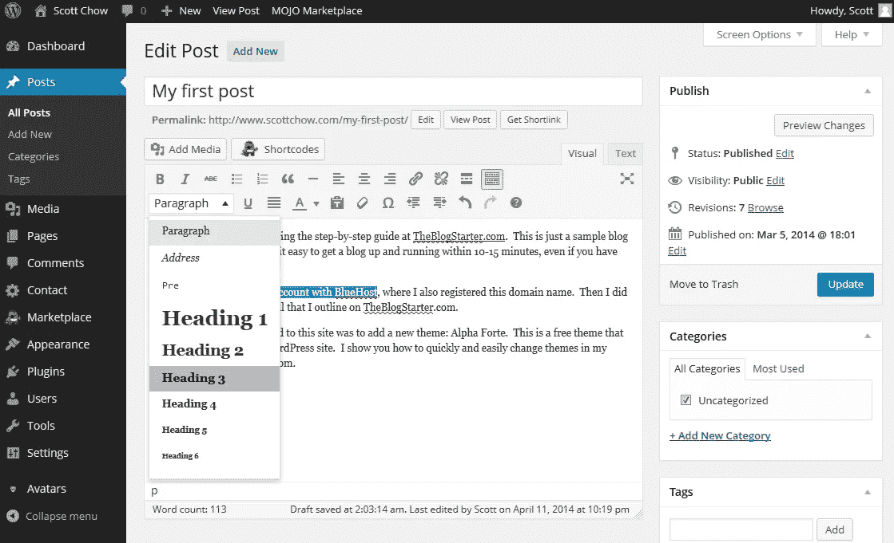

# 文字颜色和大小编辑

> 原文：<https://medium.com/visualmodo/wordpress-text-color-and-size-edit-a1b97f91e5bd?source=collection_archive---------0----------------------->

在 WordPress 中写文章时，你会在文章编辑器屏幕上看到一些文本选项，比如粗体、*斜体*和删除线。但是如果你想改变文字的颜色和大小呢？

在文章编辑界面上似乎没有简单的解决方法，所以我将向你展示一些解决方法。这将涉及一些简单的 HTML 编码，但即使你是初学者，你也应该能够复制和粘贴我给出的例子，以获得你想要的效果。

我要向你展示的方法应该只在你想对文章中的几个词进行修改时使用。如果你不喜欢你博客上文字的整体外观，最好是[在你的博客上安装一个新的主题](https://www.theblogstarter.com/10-amazing-free-wordpress-themes-for-2014/)，它有你喜欢的字体、大小和颜色。

# 更改 WordPress 文本颜色

乍一看，你可能看不到改变文本颜色的简单方法。这是因为，出于某种原因，WordPress 的开发者决定隐藏这个功能。以下是如何做到这一点:

1.  在你的 WordPress 仪表盘中，转到“文章”部分，点击你想编辑的文章。
2.  一旦你进入文章编辑界面，点击你文章旁边的“工具栏切换”按钮(下面用红色圈出)。

1.  这将在文章上方的工具栏中显示一些额外的选项。其中一个选项是“文本颜色”下拉框。

1.  用鼠标突出显示要更改的文本，然后单击“文本颜色”下拉框。选择你喜欢的任何颜色。

1.  选择颜色后，您可以单击右侧的蓝色“更新”按钮保存您的更改。

**改变文本大小**

更改文本大小的过程与我们更改文本颜色的过程相似。不过这个有点复杂。下面是如何做到这一点:

1-在你的 WordPress 仪表盘中，转到“文章”部分，点击你想要编辑的文章。

2-一旦你进入文章编辑器屏幕，点击你的文章旁边的“工具栏切换”按钮(下面用红色圈出的),打开颜色选择器和大小。

3-这将在文章上方的工具栏中显示一些额外的选项。其中一个选项是显示“段落”的下拉框。

4 —用鼠标突出显示要更改的文本，然后单击“段落”下拉框。选择“标题 3”跟随此示例。

5-一旦你选择了文本大小，你会发现它不仅改变了你突出显示的文本，而且改变了该段落中的所有文本！

6-要解决这个问题，我们需要进入文章的 HTML 代码。为此，请单击“文本”选项卡(在下面圈出)。

7-现在你在“文本”视图中，你不仅可以看到文章的文本，还可以看到控制文本大小的代码。看看我们改变了文字大小的那一段。就在该段落之前，您会看到:

### 

在这一段之后，你会看到:

这些代码标记了标题 3(我们在步骤#4 中选择的文本大小)的开始和结束位置。为了改变这一点，只改变我们想要的文本大小，我们需要将这些代码移动到适当的位置。看看下面的截图，看看如何做到这一点:

**之前:**

**之后:**

8-如您所见，您需要做的只是复制并粘贴代码，以包围您想要更改的文本。完成后，您可以单击右侧的蓝色“更新”按钮来保存您的更改。

请注意:这是 WordPress.org 博客教程。如果你仍然在使用 WordPress.com 博客，这个过程可能会略有不同。为了充分利用 WordPress 的力量，你可以考虑将你的 WordPress.com 博客转移到 WordPress.org。

除了改变文本的大小和颜色，当你点击“切换工具栏”按钮时，你会看到一些其他的新功能。这些功能包括一些有用的东西，比如带下划线的文本和缩进，所以记住“切换工具栏”按钮，以防将来需要使用这些功能。

> 你会在我们所有的 [WordPress 主题](https://visualmodo.com/wordpress-themes/)上看到所有的文字颜色选项和更多的文字编辑可能性，来扩展你的选项和设计。