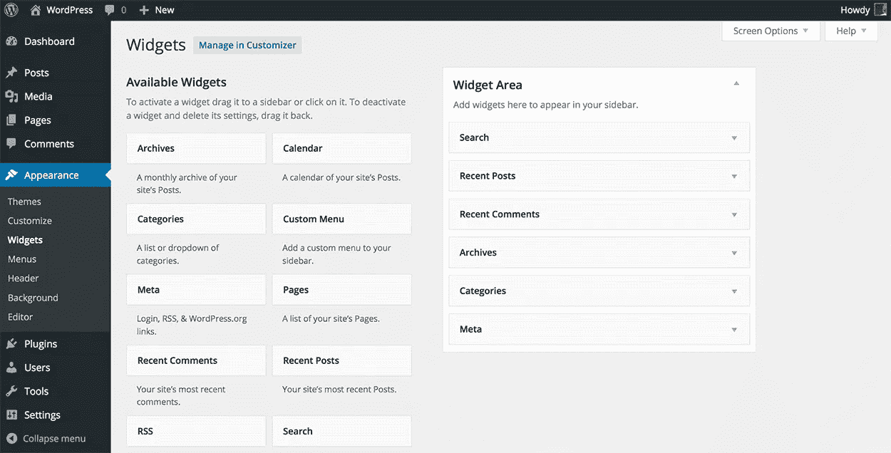
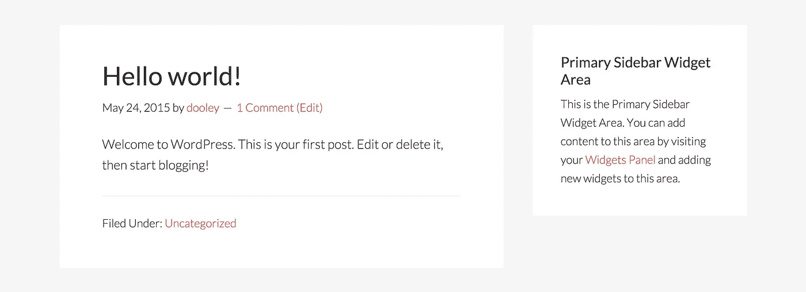

# WordPress Widgets 初学者指南

> 原文：<https://medium.com/visualmodo/wordpress-widgets-beginners-guide-b2475e505533?source=collection_archive---------0----------------------->

所有博客和页面的边栏上都有小部件，可以显示任何类型的内容，如社交图标、广告、相关帖子、类别等等。现在查看 WordPress 小部件使用的完整指南和你需要知道的关于这个功能的所有信息。

由于 WordPress 是一个相当简单的平台，新用户通常可以很快搞清楚基础知识。

一般来说，即使是最新手，对技术一窍不通的用户也能明白，用 [WordPress](https://visualmodo.com/) 建立一个网站需要一个主题，通常还需要一些插件。也就是说，WordPress 的某些方面有时会让许多新用户挠头。

其中一个谜团就是 WordPress Widgets。

# WordPress Widgets 到底是什么？

你可能会认为这个答案很简单，因为从概念上来说，*很容易。然而，用通俗易懂的语言解释它并不像我们所希望的那样容易。即使是 [WordPress Codex](http://codex.wordpress.org/WordPress_Widgets) 似乎也不能用一种容易理解的方式来解释。*

最简单的说法是， **widget 是一个内容块**(可以是一些文本、图像或链接或类别列表等)**，可以很容易地放在你的网站**上特定的预定义区域(称为“widget 化区域”)。这些小部件就绪区域通常包括站点的侧边栏、页脚、页眉，有时甚至是整个主页。

默认情况下，WordPress 核心软件附带了许多不同的小部件，可用于以下领域:

*   **“搜索”**(在您的网站上显示搜索框)
*   **“最近的”**帖子(显示您最近的帖子列表)
*   **“最近评论”**(显示您最近评论的列表)
*   **‘存档’**(显示以前帖子的链接列表)
*   **‘类别’**(显示文章列表，按类别组织)
*   **‘Meta’**(显示方便的管理链接列表)
*   主题或插件小部件。

您也不仅仅局限于这些小部件——但是我稍后会谈到这一点。

听起来很简单，对吧？那么为什么会有这些困惑呢？

# 为什么会困惑？

正如我上面提到的，WordPress 加载了一组小部件，你可以选择使用或不使用。WordPress 窗口小部件有点令人困惑的一个原因是，WordPress 正常运行并不需要它们**——但有时拥有它们也是件好事。**

另一种看待它的方式是这样的:部件有点像你的阑尾；我们都有一个，但是没有也不会死。类似地，即使 WordPress 附带了使用小部件的功能，如果你不在你的网站上使用它们，它仍然会工作。

但它们容易令人困惑的最大原因是:

> "小部件不是插件，但是一些插件包含小部件."

很困惑，对吧？

一个插件怎么可能不是一个小部件，然而，它们中的一些本质上就是小部件？为什么不把东西分开，一些叫做插件，另一些叫做小部件，可以下载和安装？那不是会让一切变得更容易吗？

嗯，不。理解下一点会让事情更容易明白为什么。

# 这都在代码里

你的站点的窗口小部件和窗口区域都是用 PHP 和 JavaScript 之类的代码创建的。这些代码和用来创建主题和插件的代码是一样的。

如前所述，WordPress 运行不需要小部件。同样，主题和插件也不需要它们。然而，开发人员可以将 PHP 和/或 JavaScript 代码片段添加到特定的文件中，并创建一个小部件来为使用他们产品的任何人增加良好的用户体验。

这比像这样全部合并要好得多，而不是不必要地为可以在网站上下载和安装的小部件创建另一个类别。

想知道为什么吗？这里有一个例子:

假设你安装了一个新的社交分享插件，比如 Monarch。激活它之后，你会发现有一个新的 Monarch 小部件，你可以把它放在一个 widget 化的区域——这是一个不错的选择。

但是，如果插件和小部件是**分离的**，那么这将意味着 Monarch 的开发者将不得不创建两个独立的产品——一个插件和一个小部件——来创建一个单一的实体并提供一个更好的整体产品。

这也意味着，如果你想用那个插件获得额外的功能，你需要安装两个，而不是安装一个。最终，这对每个人来说只是更多的工作。

因为有人可以使用相同类型的代码来创建插件，就像他们创建一个小部件一样，所以合并东西是有意义的。所以，即使一些插件和主题在你的网站上添加了你可以使用的小部件，小部件也不是完全独立于插件、主题或 WordPress 的东西——这也是有原因的…

主要是为了保持 WordPress 的简单。

# 我如何获得更多的部件？

有可能在阅读完这篇文章后，你已经发现有几种方法可以为你的站点获取更多的小部件:

1.  通过一个新的主题
2.  通过使用插件

这些都是在你的网站上获得新的 Widgets 和 Widgets 化区域的简单方法。

另一种选择是在文件中手工编写一个新的小部件。然而，这可能很复杂，除非你是一名开发人员，或者了解 PHP 之类的代码。由于使用 PHP 和在你的网站上添加新的代码如果做得不正确的话会把工作搞砸，所以最好不要弄乱东西，除非你确切地知道你在做什么。

这就是为什么我建议坚持以上两个选项中的一个。

我应该提到的一件事是，因为小部件被集成到一些主题和插件中，停用插件或切换到另一个主题将会删除您正在使用的小部件。所以，如果你停止使用一个插件或改变主题，并注意到某些部件消失了，现在你知道为什么了。

# 小部件快速提示

每一次 WordPress 安装都有一个小部件，有点特别，那就是“**文本小部件**”。虽然*文本小部件*这个名字听起来并不令人印象深刻，但是这个小部件不仅仅可以保存一两段文字。

这个小工具可以翻译你想输入的任何 HTML，这意味着你可以用它来保存图片，创建可点击的链接，你甚至可以让它与短代码一起工作。

不知道 HTML 怎么编码？你猜怎么着:没问题！

这里有一个在 WordPress 中创建 HTML 片段的快速提示，即使你不知道它是怎么回事:

1.  在 WordPress 的后端创建一个新帖子
2.  在文章编辑器中输入您希望放入文本小部件的内容，并根据个人喜好进行格式化
3.  使用常规文章编辑区右上角的标签从可视编辑器切换到文本编辑器
4.  复制你在电脑上看到的所有代码
5.  将代码粘贴到文本小部件中，然后点击保存按钮

五个简单的步骤，你就为你的站点上的小部件区域创造了一些额外的东西！

# 包装它

小部件在设计和概念上都很简单，然而，用简单的术语解释它们却令人惊讶地困难。然而，好消息是，一旦你了解了它们是什么以及它们是如何工作的，你就不太可能会忘记！