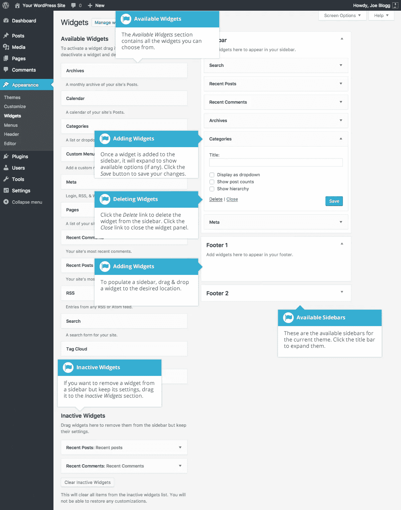
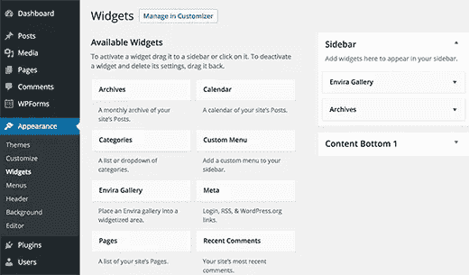

# WordPress 小部件指南

> 原文：<https://medium.com/visualmodo/wordpress-widgets-guide-c619f9880a8c?source=collection_archive---------0----------------------->

WordPress Widgets 是内容的独立部分，可以放入你的主题提供的任何 widgetized 区域。虽然这些 widget 化的区域通常被称为“侧栏”,并且经常位于左栏或右栏，但是它们也可以位于站点中的任何位置，并且它们的位置完全取决于当前的主题。许多主题在页脚区域使用这些 widgetized 侧边栏。

> Visualmodo WordPress themes 添加特殊的 WordPress 小工具供您使用，如社交图标、联系信息等等。

默认情况下，有很多小工具可以让你在你的网站上添加额外的内容，比如最近的评论、类别或者自定义菜单等等。新的插件也可以通过插件安装，同样，取决于插件的用途，它给你的网站带来的额外功能会有所不同。

*可用小部件*部分包含所有你可以选择的小部件。要填充侧边栏，请将小部件拖放到所需的位置。将小部件拖到侧边栏后，小部件将打开，允许您配置其设置。点击小工具中的*保存*按钮保存您的设置。

如果您想从侧边栏中删除一个小部件，但保存其设置以备将来使用，请将其拖到*非活动小部件*部分。如果您只想从侧边栏中删除小部件，请单击小部件中的*删除*链接。

侧边栏标题旁边的小箭头将切换侧边栏的打开和关闭。如果您将一个小部件拖放到一个关闭的边栏上，边栏和小部件会自动打开。

如果您在使用[小工具](https://br.wordpress.org/plugins/tags/widget/)时有任何问题或需要帮助，只需点击下面的评论标签。我们很乐意帮助你解决这个问题！