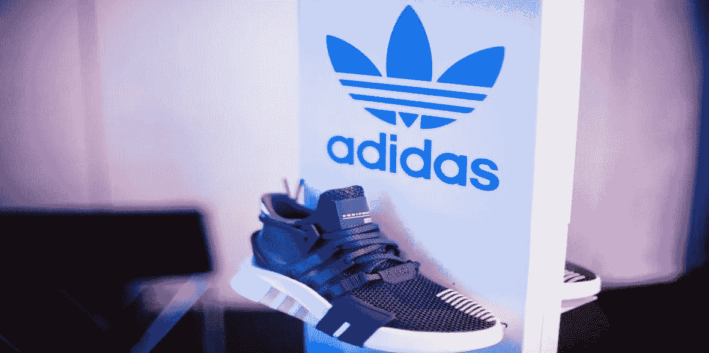

# 用 10 个简单的步骤写下你的品牌故事

> 原文：<https://medium.com/visualmodo/write-your-brand-story-in-10-easy-steps-66d554f388f9?source=collection_archive---------0----------------------->

自古以来，故事就是一种很好的交流工具。品牌故事有助于在品牌和消费者之间建立情感联系。它们是伟大的鼓舞人心的工具，因为它们点燃了人们的想象力，并常常推动他们采取行动。品牌故事是商业的唯一良好基础，但也是有利可图的，并包含令人难忘的信息，这些信息会留在人们的脑海中，因为它们使他们像角色一样思考和感受。

# 用 10 个简单的步骤写下你的品牌故事

我们认识的大多数伟大的企业家都有他们自己的故事。伟大的品牌阐明了他们的品牌故事，因为只有通过激励，我们才能为他人增加价值。所以，要想成为一个杰出成功的企业家，你必须有一个品牌故事，下面的步骤将帮助你书写[你的](https://visualmodo.com/)。

# 1.有清晰的视野

撰写品牌故事的第一步也是最重要的一步是拥有[极其清晰的愿景](https://blog.hubspot.com/marketing/inspiring-company-mission-statements)。你需要超越你提供给消费者的产品和服务。你应该专注于建立一份遗产。你应该集中精力，不仅要对你的消费者产生影响，还要对非消费者产生影响。

品牌故事不仅要能为目标受众提供服务，还要能激励他们。他们应该能够通过与你的品牌互动获得一些价值。拥有清晰的愿景也意味着你与正确的受众建立了联系。

# 2.与观众产生共鸣

了解你的受众将有助于为你的品牌所针对的角色创造一个生动的形象。这将包括了解他们的激情、他们的动机、他们遇到的挑战、他们的生活方式以及他们的好恶。它还将有助于创建您的角色，让您的角色经历挑战，然后创建一个应对挑战的工作解决方案。

你的性格应该像他们所经历的挑战一样具有争议性。提供的解决方案也应该是人性化的。例如，Blake Mycoskie 创作了 Tom 鞋，并决定将它们捐赠给 Bueno's Aries 的赤脚儿童——他知道他的观众面临的挑战。他为孩子们想出了一个可行的解决方案，他们知道自己买不起鞋子，所以他主动提出捐赠。这为他的品牌赢得了持久的[遗产](https://visualmodo.com/)。

# 3.使用描述性词语

在写你的品牌故事时，你需要尽可能多的描述。人们被他们的所见所感所感动。当你的目标受众想象自己处于同样的情况时，你应该使用能够唤起他们感受的词语。作为讲故事的人，你应该能够规划你的沟通计划。这将有助于您将故事与目标受众的渠道联系起来。你如何讲述你的故事应该是一个关键因素，因为这将能够打动你的观众。

# 4.提供历史记录

每家公司在到达今天的位置之前都有一段过去。他们对未来也有计划和目标。你的品牌故事应该有有趣但真实的证明，比如公司从何而来，是什么引导它发展到现在的位置。这些评价应该激励人心，但不应该夸大其词。

你还应该能够解释你对未来的计划，不应该只关注公司，也应该关注它的受众。重点介绍你的目标、已实现的目标和尚未实现的目标，以及你对品牌和实现的愿景。你也可以找出之前提到的一些漏洞，你做了什么来弥补它们，到目前为止的进展以及你还想走多远。

# 5.一致性

你的品牌故事应该与承诺和[形象](https://visualmodo.com/)保持一致。一致性会让你的故事真实、诚实、可信。一致的品牌故事有助于产生线索，这些线索可用于撰写令人满意的品牌故事并巩固未来。如果你今天告诉你的观众一个给定的故事，然后两个星期后想出一个不同的故事，下个月它与第一个和第二个完全不同，他们将被迫相信你在说谎，或者可能会困惑。

# 6.独特性和独创性

你应该能够提出非常真实可信的想法。这将有助于使你的品牌尽可能突出。这可能需要一个人在试图研究独特和非凡的想法时开夜车。你的品牌故事的原创性和独特性将能够吸引消费者使用你的产品，而不是去寻找替代品。随着外部市场上其他品牌的激烈竞争，唯一能让你的品牌适销对路的就是它的独特性。有各种方法可以做到这一点，例如，[选择最佳域名](https://visualmodo.com/choose-domain-name/)，这将在你的客户和潜在客户的耳边响起。

# 7.保持简单

大多数人不喜欢需要大量注意力和时间的非常详细的故事。它应该以这样一种方式来简化，使得观众在理解故事内容之前不必花费太多的精力和思考。然而，这并不意味着你为了保持简短而省略了某些细节。它应该是精确的，但包含所有需要的信息。如果它包含图像或视频，那么它们应该是不言自明的。 [WordPress](https://visualmodo.com/) 提供各种插件帮助你进行[视觉设计](https://visualmodo.com/visual-design-wordpress-plugins/)；只要确保你的设计清楚地传递了信息。

# 8.理解完整的故事弧线

品牌故事应该是长期的，这样你的受众就能理解并认同它。应该是这样的，不是一个镜头就结束的。给它一个转折，让你的观众猜测并期待知道接下来会发生什么。你的角色所经历的挑战不应该有一个即时的解决方案。

# 9.它应该有价值

你的品牌故事应该能够改变目标受众。人们应该能够从与品牌的互动中获得一些价值。在决定为你的品牌做一个特定的故事之前，问问你自己这个故事给你的营销努力增加了什么价值？确保量化这个值；你毕竟是在做生意。

# 10.角色应该能引起观众的共鸣

目标受众应该能够理解你故事中的人物角色。这将有助于增进他们的情感联系。例如，你的品牌不应该有不健康的字符，但你却在谈论食品供应。

一个好的品牌故事决定了你的品牌能在多大程度上销售给你的目标受众。它不仅应该是迷人的，而且还应该激励和情感依恋。把更多的注意力放在创造你的品牌故事上，这会让你更容易推销你的产品。

***作者简介:索菲亚·克拉克*** *是一位富有创造力的作家。她正在做几个项目。而其中一个就是*[*Edubirdie*](https://edubirdies.org/)*。闲暇时，她喜欢写小说和阅读小说。她的大梦想是有一天出版一本书。在* [*G+*](https://plus.google.com/u/0/+SophiaClark) *上与她连线。*