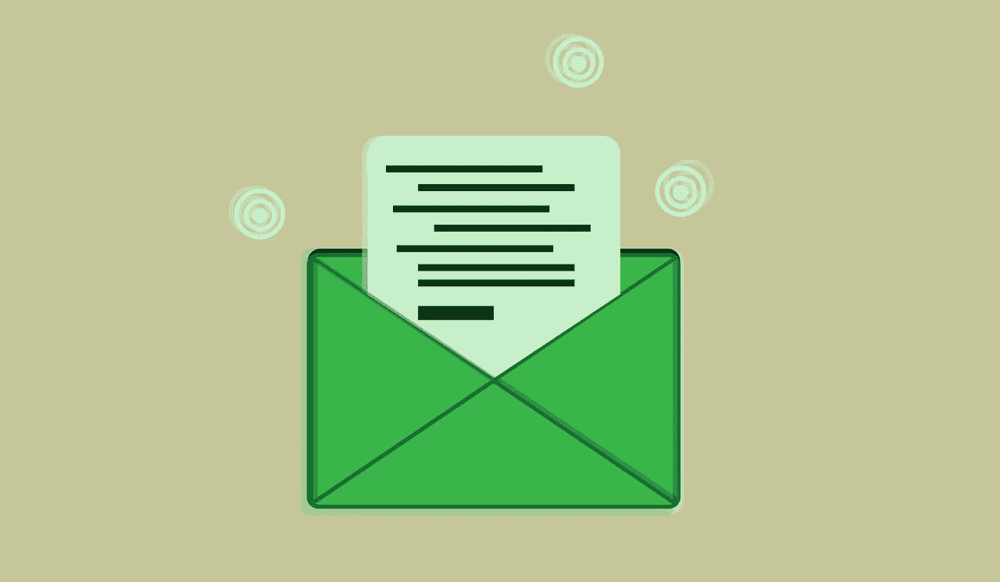

# 写一封合适的面试跟进邮件

> 原文：<https://medium.com/visualmodo/writing-an-interview-follow-up-email-properly-d5a0594a16c9?source=collection_archive---------0----------------------->

工作面试后，发一封感谢信作为后续邮件，既礼貌又对你的求职有利。你的说明是一个机会，可以强化你作为申请人的优势，肯定你对这个职位的兴趣，如果有必要的话，回应面试中出现的任何问题。

以下是写一封有力的后续感谢信或电子邮件的建议。你还可以在下面找到一个在工作面试后发送跟进信的例子，以及两个跟进邮件的例子。您可以使用这些样本中的任何一个作为您自己的跟进说明的模板。

# 面试跟进电子邮件目的

面试跟进邮件背后的想法很简单。你可能在面试中表现出色，但你很可能不是唯一一个竞争这份工作的人。例如，如果你的面试发生在一天的早些时候，随后的申请人可能会让他们忘记你，即使你当时让他们惊叹不已。

通过一封跟进邮件，你可以提醒决定谁被录用的人，你是最佳人选。只要你的面试进展顺利(我们确信是的！)发一封这样的电子邮件会让你比其他申请者更有优势，尤其是因为它显示出你的积极性和高度兴趣。

# 一边写一边想

虽然发送面试邮件有明显的好处，但如果你的方法是错误的，也有几种可能适得其反。例如，如果你使用了错误的语气，你甚至会让招聘人员不太可能考虑你。只是给你一个想法，以下是你的面试跟进邮件[*不该读的*](https://www.themuse.com/advice/5-followup-emails-that-scare-hiring-managers-and-what-to-write-instead)*:*

> *嘿，*
> 
> *我昨天去面试了，我想了解一下这个职位的最新情况。请尽快回复我。*
> 
> *祝一切顺利，*

*如果我们正在招募新成员，那封邮件会立即说服我们放弃那个申请人，因为它显示出明显缺乏专业精神。以下是你需要记住的，这样你的[面试](https://visualmodo.com/interview-questions-preparation-guide-and-practice/)才能更好地跟进邮件。*

# *考虑*

*请稍等片刻再发送。有些人在面试后等了一天，而有些人则玩长线游戏，拖延一周。无论如何，在点击发送按钮之前，至少要等 24 小时。*

*重申你对这份工作的兴趣。这应该是面试跟进邮件的核心，因为你的目标是提醒招聘人员你是最佳候选人。*

*感谢他们的关注。一封好的面试跟进邮件应该包括一段简短的感谢招聘人员的时间。足够礼貌但听起来不太夸张。*

*除此之外，不管你有多紧张，保持跟进邮件的简短通常是个好主意。换句话说，你的面试应该为你做大部分繁重的工作。如果面试者在你的会议后不想雇用你，很可能一封后续的电子邮件不会改变这一点。然而，它能在[成功面试](https://www.thebalancecareers.com/job-interview-questions-and-answers-2061204)的基础上*帮你敲定交易。**

# *电子邮件中的大多数元素*

*为了获得最好的结果，每封面试跟进邮件都应该包含一些要素。让我们看看那些是什么。*

# *主题行*

*与其他[类型的电子邮件](https://optinmonster.com/13-types-of-emails-you-need-to-be-sending-your-email-list/)不同，当涉及到面试跟进时，你不需要太过花哨。在某些情况下，招聘人员甚至可能不会看跟进邮件，因此“抓住”他们的注意力可能是不可能的。*

*相反，我们建议你使用简单的主题。例如，以下任何一个都是不错的选择:谢谢你的时间。跟进我的[申请](https://www.monster.com.my/career-advice/cover-letters-that-get-you-the-interview-3711.html)。关于我面试 Y 职位的事。*

*这些标题没有一个过于咄咄逼人，这正是你的目标。根据我们的经验，在你的标题中加入一句简单的谢谢也是不错的做法，尽管你的收获可能会有所不同。*

*有时候，你会碰到面试跟进邮件，标题是“关于 Y 职位有什么更新吗？”。这种标题听起来有点苛求，可能会让招聘人员失去兴趣，所以你可能要避免使用这种紧迫的语言。*

# *对面试官花时间说“谢谢”*

*尽管你的标题中可能还包括一句“谢谢”，但花时间在邮件正文中写一句“谢谢”也很重要。正如我们之前提到的，你希望你的感谢听起来真诚，所以没有必要走极端。这里有一个简单的例子来说明如何做到这一点:*

> *你好，乔先生，*
> 
> *你可能记得我上周面试了首席运营官的职位。我想感谢你的时间，并重申我对这份工作的兴趣。*
> 
> *期待你的回复，*

*在面试跟进邮件时，绝大多数情况下你都希望使用专业的语气。对于一些工作来说，一封更随意的电子邮件可能是有益的，但这些往往是例外。*

*请注意，在这个例子中，感谢信息很快，然后我们继续重申我们对该职位的兴趣。根据我们的经验，负责招聘的人不会被冗长、滔滔不绝的段落所左右，所以保持简洁！*

# *记得一些关于面试的事情。*

*如果你是一个健谈的人，你可能会认出这个“小把戏”。这个想法是，当你再次遇到某人时，提及你们上次见面时讨论过的一些事情会表现出兴趣。这是非常基本的，但是它可以帮助其他人更好地理解你。*

*在你的[面试](https://www.indeed.com/career-advice/interviewing/follow-up-email-examples-after-interview)中，你很有可能涉及了很多内容，其中可能包括一个特定的话题或有趣的评论。如果你能回忆起这种性质的事情，并把它塞进你的电子邮件，这不仅表明你在关注，而且还能帮助唤起他们的记忆。让我们看另一个简单的例子:*

> *你好，乔先生，*
> 
> *你可能还记得，上周我面试了首席运营官的职位。我们聊了很多关于公司和未来几年的前景。我对您提到的如何自动化流程以提高生产率特别感兴趣。*
> 
> *我想花一点时间再次感谢您的时间，并重申我对该职位的兴趣。*
> 
> *祝一切顺利，*

*像往常一样，记得保持事情简短。一些面试官可能会喜欢一封关于你讨论的主题的深度邮件。然而，在大多数情况下，他们会收到很多像你这样的信息，所以他们会感谢你的简洁。如果你能在听起来专业、保持简洁和提醒他们你是谁之间找到一个很好的平衡，这将极大地帮助你获得工作的机会！*

# *最后的话*

*如果你的邮件没有得到回复，再跟进一次。大多数人不是故意忽视你的。他们真的很忙，很可能忘记了你的邮件。只要你亲切有礼，而不是咄咄逼人，这些跟进邮件就是你的兴趣和善意的简单表示。*